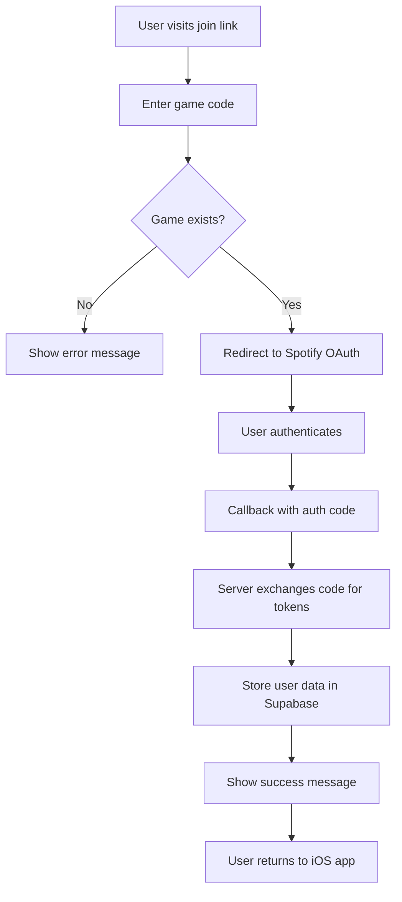

# Spot Join Website

A modern Next.js website for joining Spot games. This website allows users to join Spotify-based music guessing games through a web interface with OAuth authentication.

## 🚀 Features

- **Next.js 15** with TypeScript for type safety
- **Shadcn/UI** components for modern, accessible UI
- **Tailwind CSS** for responsive design with dark mode
- **Spotify OAuth** integration with proper error handling
- **Supabase** integration for game management
- **Mobile-optimized** design
- **Deep linking** support for iOS app integration
- **Always-on dark mode** matching the iOS app theme
- **Clean, professional UI** without emojis

## 🛠️ Tech Stack

- **Framework**: Next.js 15 (App Router)
- **Language**: TypeScript
- **Styling**: Tailwind CSS + Shadcn/UI
- **UI Components**: Shadcn/UI component library
- **Backend**: Supabase (PostgreSQL + Realtime)
- **Authentication**: Spotify OAuth 2.0 (Authorization Code Flow)
- **Deployment**: Vercel (recommended)
- **Analytics**: Custom event tracking

## 📱 How It Works



## 🏗️ Architecture

### App Router Structure
```
src/
├── app/                    # Next.js App Router
│   ├── page.tsx           # Main join page
│   ├── callback/          # OAuth callback handler
│   ├── success/           # Success confirmation
│   ├── error.tsx          # Error boundary
│   ├── layout.tsx         # Root layout with dark mode
│   ├── globals.css        # Dark theme CSS variables
│   └── api/               # Server-side API routes
│       └── spotify/token/ # Token exchange endpoint
├── components/            # Reusable UI components
│   ├── ui/               # Shadcn/UI components
│   ├── game-code-input.tsx
│   ├── progress-steps.tsx
│   └── error-display.tsx
├── lib/                  # Business logic
│   ├── spotify.ts        # OAuth & API calls
│   ├── supabase.ts       # Database operations
│   ├── analytics.ts      # Event tracking
│   └── utils.ts          # Utilities
└── types/                # TypeScript interfaces
    └── index.ts
```

### Key Integrations

**Spotify OAuth Flow**:
1. User clicks "Join with Spotify"
2. Redirected to Spotify with game ID in state
3. User authorizes app
4. Callback receives authorization code
5. Server exchanges code for access/refresh tokens
6. Tokens stored in Supabase (currently plaintext)

**Supabase Integration**:
- `games` table - Game room information
- `game_players` table - Player profiles
- `player_data` table - Encrypted tokens and metadata
- Real-time subscriptions for live updates

## 📦 Installation

1. **Clone the repository**
   ```bash
   git clone https://github.com/maartencorpel/spot-join-web.git
   cd spot-join-nextjs
   ```

2. **Install dependencies**
   ```bash
   npm install
   ```

3. **Set up environment variables**
   ```bash
   cp .env.example .env.local
   ```
   Then edit `.env.local` with your actual credentials.

4. **Run the development server**
   ```bash
   npm run dev
   ```

## 🔧 Environment Variables

Create a `.env.local` file with the following variables:

```env
# Supabase Configuration
NEXT_PUBLIC_SUPABASE_URL=your_supabase_url
NEXT_PUBLIC_SUPABASE_ANON_KEY=your_supabase_anon_key

# Spotify Configuration
NEXT_PUBLIC_SPOTIFY_CLIENT_ID=your_spotify_client_id
NEXT_PUBLIC_SPOTIFY_REDIRECT_URI=https://your-domain.com/callback

# Spotify API (Server-side only)
SPOTIFY_CLIENT_SECRET=your_spotify_client_secret
```

### Required Spotify Scopes
- `user-top-read` - Access to user's top tracks and artists
- `user-read-email` - User's email address
- `user-read-private` - User's subscription type

## 🚀 Deployment

### Vercel (Recommended)

1. Connect your GitHub repository to Vercel
2. Set the environment variables in Vercel dashboard
3. Update `NEXT_PUBLIC_SPOTIFY_REDIRECT_URI` to production URL
4. Deploy automatically on every push to main

### Production Checklist

- [ ] Environment variables configured
- [ ] Spotify redirect URI updated in Spotify Developer Dashboard
- [ ] Supabase RLS policies configured
- [ ] Error monitoring set up
- [ ] Analytics tracking verified

## 📱 Usage

1. **Game Host**: Creates a game in the iOS app and shares the join link
2. **Game Joiner**: Visits the website with the game code
3. **Authentication**: User authenticates with Spotify
4. **Game Join**: User is added to the game and can participate

## 🔗 Integration

This website integrates with:
- **iOS App**: Deep linking support (`spot://join?game=ABC123`)
- **Spotify API**: User authentication and data access
- **Supabase**: Game state and player management

## 🎨 Recent Improvements

### Dark Mode Implementation
- Always-on dark theme matching iOS app
- Custom CSS variables for consistent theming
- Proper contrast ratios and accessibility

### UI/UX Enhancements
- Removed all emojis for cleaner, professional appearance
- Clean Shadcn/UI components with Tailwind utilities
- Specific, actionable error messages
- Improved loading states and progress indicators

### Code Quality
- TypeScript interfaces for all data structures
- Proper error boundaries and handling
- Server-side token exchange for security
- Comprehensive analytics tracking

## 🔒 Security Considerations

### Current Implementation
- ✅ Client secret stored server-side only
- ✅ Authorization Code flow (secure)
- ✅ Environment variables properly configured
- ✅ HTTPS enforced in production

### Known Issues
- ⚠️ **Token encryption not implemented** - Currently storing tokens in plaintext
- ⚠️ **No rate limiting** on API routes
- ⚠️ **Limited input validation** on game codes

See [IMPROVEMENTS.md](./IMPROVEMENTS.md) for detailed security recommendations.

## 📊 Analytics

The app tracks key events for monitoring and optimization:
- Game verification attempts
- OAuth flow completion rates
- Error occurrences and types
- User journey progression

## 🧪 Development

### Available Scripts
```bash
npm run dev      # Start development server
npm run build    # Build for production
npm run start    # Start production server
npm run lint     # Run ESLint
```

### Code Style
- TypeScript strict mode enabled
- ESLint with Next.js configuration
- Prettier for code formatting
- Shadcn/UI component conventions

## 📚 Documentation

- [Technical Guide](./TECHNICAL_GUIDE.md) - Comprehensive technical documentation
- [API Reference](./API_REFERENCE.md) - API endpoints and integrations
- [Improvements](./IMPROVEMENTS.md) - Known issues and enhancement recommendations

## 📄 License

This project is part of the Spot game ecosystem.