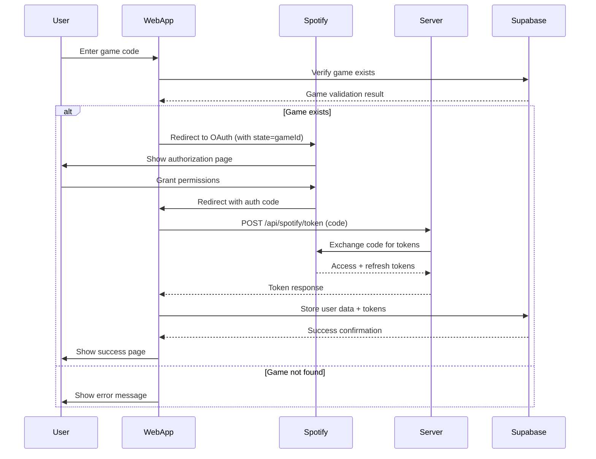

# Tracks Match - Technical Guide

## Table of Contents

1. [Architecture Overview](#architecture-overview)
2. [Next.js App Router Structure](#nextjs-app-router-structure)
3. [Component Architecture](#component-architecture)
4. [Data Flow & State Management](#data-flow--state-management)
5. [Authentication Flow](#authentication-flow)
6. [Database Integration](#database-integration)
7. [Styling & Theming](#styling--theming)
8. [Error Handling](#error-handling)
9. [Analytics & Monitoring](#analytics--monitoring)
10. [Security Implementation](#security-implementation)
11. [Performance Considerations](#performance-considerations)
12. [Development Workflow](#development-workflow)

---

## Architecture Overview

The Tracks Match web app is built as a **single-page application** using Next.js 15 with the App Router pattern. It serves as a web-based entry point for users to join Spotify music guessing games created on the iOS app.

### Core Principles

- **Server-Side Security**: Sensitive operations (token exchange) happen server-side
- **Client-Side UX**: Rich, responsive UI with immediate feedback
- **Type Safety**: Full TypeScript coverage with strict mode
- **Component Reusability**: Shadcn/UI components with custom extensions
- **Error Resilience**: Comprehensive error boundaries and user feedback

### Technology Stack

```typescript
// Core Framework
Next.js 15 (App Router)
React 19
TypeScript 5

// UI & Styling
Shadcn/UI (Radix UI primitives)
Tailwind CSS 3.4
CSS Variables (dark mode)

// Backend & Database
Supabase (PostgreSQL + Realtime)
Vercel Functions (serverless)

// Authentication
Spotify OAuth 2.0 (Authorization Code Flow)
JWT token handling

// Development
ESLint + Prettier
Class Variance Authority (component variants)
```

---

## Next.js App Router Structure

### File Organization

```
src/app/
├── layout.tsx              # Root layout with dark mode
├── page.tsx                # Main join page (client component)
├── error.tsx               # Error boundary (client component)
├── globals.css             # Global styles + CSS variables
├── callback/
│   └── page.tsx            # OAuth callback handler
├── success/
│   └── page.tsx            # Success confirmation page
└── api/
    └── spotify/
        └── token/
            └── route.ts    # Server-side token exchange
```

### Server vs Client Components

**Server Components** (default):
- `layout.tsx` - Root layout with metadata
- `api/` routes - Server-side API handlers

**Client Components** (`'use client'`):
- `page.tsx` - Interactive main page
- `callback/page.tsx` - OAuth callback with state management
- `success/page.tsx` - Success page with window management
- `error.tsx` - Error boundary with reset functionality

### App Router Benefits

1. **Automatic Code Splitting**: Each route gets its own bundle
2. **Server Components**: Reduced client-side JavaScript
3. **Built-in Error Boundaries**: Automatic error handling
4. **Nested Layouts**: Shared UI without prop drilling
5. **Streaming**: Progressive page loading

---

## Component Architecture

### Shadcn/UI Integration

The app uses Shadcn/UI as the foundation, with custom components built on top:

```typescript
// Base Shadcn/UI components used
- Button (with variants: default, outline, destructive)
- Card (CardHeader, CardContent, CardTitle, CardDescription)
- Alert (AlertDescription with variants)
- Input, InputOTP (for game code entry)
- Progress (for loading states)

// Custom components extending Shadcn/UI
- GameCodeInput (InputOTP wrapper with validation)
- ProgressSteps (multi-step progress indicator)
- ErrorDisplay (Alert wrapper with retry functionality)
- ErrorBoundary (React error boundary with fallback UI)
```

### Component Hierarchy

```
RootLayout
├── MainPage
│   ├── GameCodeInput
│   ├── StatusAlert
│   └── ActionButtons
├── CallbackPage
│   ├── ProgressSteps
│   ├── StatusDisplay
│   └── DebugInfo (dev only)
├── SuccessPage
│   ├── SuccessAlert
│   ├── NextSteps
│   └── ActionButtons
└── ErrorBoundary
    ├── ErrorAlert
    └── RecoveryActions
```

### Styling Conventions

```typescript
// Tailwind utility classes (preferred)
className="min-h-screen bg-background flex items-center justify-center p-4"

// CSS variables for theming
className="text-foreground bg-card border-border"

// Component variants using CVA
const buttonVariants = cva("base-styles", {
  variants: {
    variant: { default: "...", outline: "..." },
    size: { default: "...", lg: "..." }
  }
})
```

---

## Data Flow & State Management

### State Management Approach

The app uses **React's built-in state management** rather than external libraries:

```typescript
// Local component state
const [joinState, setJoinState] = useState<JoinState>('idle')
const [gameId, setGameId] = useState<string>('')
const [errorMessage, setErrorMessage] = useState<string>('')

// URL state management
const searchParams = useSearchParams()
const gameIdFromUrl = searchParams.get('game')

// Browser state persistence
localStorage.setItem('pendingGameId', gameId)
```

### Data Flow Pattern

1. **URL → State**: Game ID extracted from URL parameters
2. **User Input → Validation**: Game code input with real-time validation
3. **API Calls → State Updates**: Async operations update UI state
4. **State → UI**: Reactive UI updates based on state changes

### State Types

```typescript
type JoinState = 'idle' | 'verifying' | 'authenticating' | 'joining' | 'success' | 'error'

interface GameValidationResult {
  exists: boolean
  game?: Game
  error?: string
}

interface TokenData {
  access_token: string
  refresh_token?: string
  expires_in: number
  token_type: string
  scope: string
}
```

---

## Authentication Flow

### OAuth 2.0 Authorization Code Flow



### Token Exchange Implementation

```typescript
// Client-side: Redirect to Spotify
const authUrl = `https://accounts.spotify.com/authorize?` +
  `client_id=${SPOTIFY_CLIENT_ID}` +
  `&response_type=code` +
  `&redirect_uri=${encodeURIComponent(REDIRECT_URI)}` +
  `&scope=${encodeURIComponent(scopes)}` +
  `&state=${gameId}` // Game ID passed in state

// Server-side: Exchange code for tokens
export async function POST(request: NextRequest) {
  const { code, redirect_uri } = await request.json()
  
  const response = await fetch('https://accounts.spotify.com/api/token', {
    method: 'POST',
    headers: { 'Content-Type': 'application/x-www-form-urlencoded' },
    body: new URLSearchParams({
      grant_type: 'authorization_code',
      code,
      redirect_uri,
      client_id: process.env.NEXT_PUBLIC_SPOTIFY_CLIENT_ID!,
      client_secret: process.env.SPOTIFY_CLIENT_SECRET!
    })
  })
  
  return response.json()
}
```

### Security Considerations

- **Client Secret**: Never exposed to client, only used server-side
- **State Parameter**: Game ID passed in OAuth state to prevent CSRF
- **HTTPS Only**: All production requests use HTTPS
- **Token Storage**: Currently plaintext (⚠️ needs encryption)

---

## Database Integration

### Supabase Schema

```sql
-- Games table
CREATE TABLE games (
  id VARCHAR(6) PRIMARY KEY,
  host_device_id VARCHAR(255),
  status VARCHAR(20) DEFAULT 'waiting',
  created_at TIMESTAMP DEFAULT NOW(),
  expires_at TIMESTAMP
);

-- Game players table
CREATE TABLE game_players (
  id UUID PRIMARY KEY DEFAULT gen_random_uuid(),
  game_id VARCHAR(6) REFERENCES games(id),
  spotify_user_id VARCHAR(255),
  display_name VARCHAR(255),
  email VARCHAR(255),
  image_url TEXT,
  joined_at TIMESTAMP DEFAULT NOW()
);

-- Player data table (tokens + metadata)
CREATE TABLE player_data (
  id UUID PRIMARY KEY DEFAULT gen_random_uuid(),
  game_player_id UUID REFERENCES game_players(id),
  encrypted_access_token TEXT, -- ⚠️ Currently plaintext
  encrypted_refresh_token TEXT, -- ⚠️ Currently plaintext
  token_expiration TIMESTAMP,
  tracks_count INTEGER DEFAULT 0,
  artists_count INTEGER DEFAULT 0,
  created_at TIMESTAMP DEFAULT NOW()
);
```

### Database Operations

```typescript
// Check if game exists
static async checkGameExists(gameId: string): Promise<Game | null> {
  const { data, error } = await supabase
    .from('games')
    .select('*')
    .eq('id', gameId)
    .single()
    
  return error ? null : data
}

// Join game (insert player + data)
static async joinGame(gameId: string, spotifyUser: any, tokens: TokenData) {
  // Insert player record
  const { data: playerData } = await supabase
    .from('game_players')
    .insert({ game_id, spotify_user_id, display_name, email, image_url })
    .select()
    .single()
    
  // Insert token data
  await supabase
    .from('player_data')
    .insert({
      game_player_id: playerData.id,
      encrypted_access_token: tokens.access_token, // ⚠️ Plaintext
      encrypted_refresh_token: tokens.refresh_token, // ⚠️ Plaintext
      token_expiration: new Date(Date.now() + tokens.expires_in * 1000)
    })
}
```

---

## Styling & Theming

### Dark Mode Implementation

The app uses **always-on dark mode** with CSS variables:

```css
:root {
  /* Dark mode variables as default */
  --background: 222.2 84% 4.9%;      /* Dark slate */
  --foreground: 210 40% 98%;         /* Near white */
  --card: 222.2 84% 4.9%;            /* Same as background */
  --card-foreground: 210 40% 98%;    /* Same as foreground */
  --primary: 142 76% 36%;            /* Spotify green */
  --primary-foreground: 355.7 100% 97.3%;
  --secondary: 252 100% 67%;         /* Tracks purple */
  --muted: 217.2 32.6% 17.5%;        /* Muted slate */
  --muted-foreground: 215 20.2% 65.1%;
  --border: 217.2 32.6% 17.5%;       /* Subtle borders */
  --input: 217.2 32.6% 17.5%;        /* Input backgrounds */
  --ring: 142 76% 36%;               /* Focus rings */
  --radius: 0.75rem;                 /* Border radius */
}
```

### Tailwind Configuration

```typescript
// tailwind.config.ts
module.exports = {
  darkMode: "class", // Enables class-based dark mode
  content: ["./src/**/*.{js,ts,jsx,tsx}"],
  theme: {
    extend: {
      colors: {
        // CSS variables mapped to Tailwind colors
        background: "hsl(var(--background))",
        foreground: "hsl(var(--foreground))",
        primary: "hsl(var(--primary))",
        // ... etc
      }
    }
  }
}
```

### Component Styling Patterns

```typescript
// Background patterns
className="min-h-screen bg-background" // Full page dark background

// Card styling
className="bg-card text-card-foreground border border-border rounded-lg"

// Text hierarchy
className="text-foreground" // Primary text
className="text-muted-foreground" // Secondary text

// Interactive elements
className="bg-primary text-primary-foreground hover:bg-primary/90"
```

---

## Error Handling

### Error Boundary Implementation

```typescript
// app/error.tsx - Next.js error boundary
export default function Error({ error, reset }: ErrorProps) {
  return (
    <div className="min-h-screen bg-background flex items-center justify-center p-4">
      <Card className="w-full max-w-md">
        <CardHeader>
          <CardTitle className="text-2xl">Application Error</CardTitle>
        </CardHeader>
        <CardContent>
          <Alert variant="destructive">
            <AlertDescription>
              An unexpected application error occurred. This usually indicates a technical issue.
            </AlertDescription>
          </Alert>
          <Button onClick={reset} className="w-full mt-4">
            Try Again
          </Button>
        </CardContent>
      </Card>
    </div>
  )
}
```

### Error Handling Strategy

1. **User-Facing Errors**: Specific, actionable messages
   ```typescript
   // Game not found
   "This game code doesn't exist. Please check the code and try again."
   
   // Network error
   "Unable to verify the game. Please check your internet connection and try again."
   ```

2. **Technical Errors**: Caught by error boundary
   ```typescript
   // JavaScript crashes, unexpected exceptions
   "Application Error - An unexpected application error occurred."
   ```

3. **Validation Errors**: Real-time feedback
   ```typescript
   // Invalid game code format
   if (!/^[0-9]{4}$/.test(gameCode)) {
     setErrorMessage("Game code must be 4 characters long")
   }
   ```

### Error Recovery

- **Retry Mechanisms**: "Try Again" buttons for failed operations
- **Fallback Actions**: "Go Home" option when stuck
- **Progressive Enhancement**: App works without JavaScript for basic functionality

---

## Analytics & Monitoring

### Event Tracking

```typescript
// lib/analytics.ts
export function trackEvent(eventName: string, properties: Record<string, any> = {}) {
  // Client-side analytics (can be extended to Google Analytics, Mixpanel, etc.)
  console.log('Analytics:', eventName, properties)
}

export function trackGameEvent(event: string, gameId: string, properties = {}) {
  trackEvent(`game_${event}`, { gameId, ...properties })
}

export function trackOAuthEvent(event: string, gameId: string, properties = {}) {
  trackEvent(`oauth_${event}`, { gameId, ...properties })
}
```

### Tracked Events

- `game_verification_started` - User enters game code
- `game_found` - Game code is valid
- `game_not_found` - Game code doesn't exist
- `oauth_started` - User redirected to Spotify
- `oauth_completed` - User successfully authenticated
- `oauth_failed` - Authentication failed
- `game_joined` - User successfully joined game
- `error_occurred` - Any error with context

### Monitoring Strategy

1. **Client-Side Logging**: Console logs for development
2. **Error Tracking**: Error boundary captures crashes
3. **Performance Monitoring**: Can be extended with Vercel Analytics
4. **User Journey**: Track progression through join flow

---

## Security Implementation

### Current Security Measures

✅ **Implemented**:
- Client secret stored server-side only
- Authorization Code flow (secure OAuth pattern)
- HTTPS enforced in production
- Environment variables for sensitive data
- Input validation on game codes
- CSRF protection via OAuth state parameter

⚠️ **Needs Improvement**:
- Token encryption (currently plaintext storage)
- Rate limiting on API endpoints
- Input sanitization for all user inputs
- Content Security Policy headers
- Request timeout handling

### Security Architecture

```typescript
// Secure token exchange (server-side only)
// app/api/spotify/token/route.ts
export async function POST(request: NextRequest) {
  // Validate environment variables
  if (!process.env.SPOTIFY_CLIENT_SECRET) {
    throw new Error('Missing required environment variables')
  }
  
  // Exchange code for tokens (never expose client secret)
  const response = await fetch('https://accounts.spotify.com/api/token', {
    method: 'POST',
    headers: { 'Content-Type': 'application/x-www-form-urlencoded' },
    body: new URLSearchParams({
      grant_type: 'authorization_code',
      code: body.code,
      redirect_uri: body.redirect_uri,
      client_id: process.env.NEXT_PUBLIC_SPOTIFY_CLIENT_ID!,
      client_secret: process.env.SPOTIFY_CLIENT_SECRET! // Server-side only
    })
  })
}
```

### Recommended Security Improvements

1. **Token Encryption**: Implement AES-256 encryption for stored tokens
2. **Rate Limiting**: Add rate limiting to prevent abuse
3. **Input Validation**: Comprehensive validation for all inputs
4. **Security Headers**: Implement CSP, HSTS, and other security headers
5. **Audit Logging**: Log security-relevant events

---

## Performance Considerations

### Current Performance Features

- **Next.js App Router**: Automatic code splitting and optimization
- **Server Components**: Reduced client-side JavaScript
- **Image Optimization**: Next.js automatic image optimization
- **Font Optimization**: Inter font with `font-display: swap`
- **Bundle Analysis**: Small bundle size (~162KB first load)

### Performance Metrics

```
Route (app)                                 Size  First Load JS
┌ ○ /                                    8.51 kB         162 kB
├ ○ /callback                            4.78 kB         158 kB
├ ○ /success                             2.30 kB         112 kB
└ ○ /error                               997 B         103 kB
```

### Optimization Opportunities

1. **Lazy Loading**: Implement lazy loading for non-critical components
2. **Prefetching**: Prefetch Spotify auth URLs for faster navigation
3. **Caching**: Implement proper caching strategies
4. **Bundle Splitting**: Further optimize bundle sizes
5. **CDN**: Use CDN for static assets

---

## Development Workflow

### Local Development

```bash
# Start development server
npm run dev

# Build for production
npm run build

# Start production server
npm run start

# Run linting
npm run lint
```

### Environment Setup

1. **Development**: `http://localhost:3000`
2. **Production**: `https://tracks-match.vercel.app`
3. **Environment Variables**: Copy `.env.example` to `.env.local`

### Code Quality

- **TypeScript**: Strict mode enabled
- **ESLint**: Next.js recommended configuration
- **Prettier**: Consistent code formatting
- **Git Hooks**: Can be added for pre-commit checks

### Testing Strategy

Currently no tests implemented. Recommended testing approach:

1. **Unit Tests**: Jest + React Testing Library
2. **Integration Tests**: API route testing
3. **E2E Tests**: Playwright for user flows
4. **Type Tests**: TypeScript compiler checks

---

## Deployment & Infrastructure

### Vercel Deployment

```bash
# Automatic deployment on git push
git push origin main

# Manual deployment
vercel --prod
```

### Environment Configuration

```env
# Production environment variables
NEXT_PUBLIC_SUPABASE_URL=https://irpkbppodhjvytbyluud.supabase.co
NEXT_PUBLIC_SUPABASE_ANON_KEY=your_production_key
NEXT_PUBLIC_SPOTIFY_CLIENT_ID=530bf2b1f07841b8837a54b15bf6b64d
NEXT_PUBLIC_SPOTIFY_REDIRECT_URI=https://tracks-match.vercel.app/callback
SPOTIFY_CLIENT_SECRET=your_production_secret
SPOTIFY_REDIRECT_URI_ALLOWLIST=https://tracks-match.vercel.app/callback
```

### Monitoring & Observability

- **Vercel Analytics**: Built-in performance monitoring
- **Error Tracking**: Can be extended with Sentry
- **Logging**: Console logs for development, structured logging for production
- **Uptime Monitoring**: External service monitoring recommended

---

This technical guide provides a comprehensive overview of the Tracks Match web application architecture, implementation details, and development practices. For specific implementation details, refer to the source code and inline comments.
